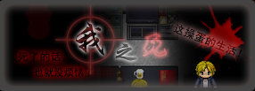

# 老鹰的作品索引页

---

## 前言

### 关于老鹰

喜欢自己捣鼓的RPG Maker爱好者，虽然做的东西都很一般，但是真的很快乐～

### 联络方式

- LOFTER - [老鹰的巢](https://oneeyedeagle.lofter.com/)

- 新浪微博 - [@独眼老鹰](https://weibo.com/oneeyedeagle)

### 插件分享

因为自己是代码出身，所以在编写插件上的时间花费越来越多，为了能更好地帮助到其他人，特此开了一个仓库来存放可供使用的RMVA插件

[GitHub仓库地址](https://github.com/OneEyedEagle/EAGLE-RGSS3)

### 索引说明

- 合集分享 [百度云载点](https://pan.baidu.com/s/1-VAsCZNCGHTS_udyeqyERg )  _yqk4_ （含全部已发布内容，如遇单独分享失效，可至此处查找）
- 本文中的发布页链接一般为LOFTER博客页地址，或[Project1](https://rpg.blue/)论坛内地址

---

## 2014.8

### 追逐战练习

- 游戏类型Tag

纯追逐战 | 手残党 | 试水作（初步尝试追逐战）

- 剧情Tag

无剧情 |

- 简介

  控制主角，在一间大房子中不断尝试，找齐三把钥匙，然后从花园上方的正门逃出去；分三种难度。

- 制作感想

  其实制作初衷真的非常简单，因为在当时的7月份才真正接触RM，那时也才被岚少实况的魔女之家所震撼到，于是……就拆了个包学习了下然后自己做了这个，其实并没有正式发布，一直也只在澄海工作室的群里和这个LOFTER里出现。

- 发布页：<http://oneeyedeagle.lofter.com/post/456402_2d0554a>

---

### 勇者之路

- 游戏类型Tag

地图战斗 | ARPG | 试水作（初步尝试地图战斗）

- 剧情Tag

搞怪 | 轻松

- 简介

  你是一名勇者，你此刻在酒馆里，神马！你又要欠账了！这怎么可以呢？等着，我就去清了魔物，拿它们的肝脏换的钱来结账！

- 制作感想

  当时也是第一次被安利了66RPG论坛，看到这么多的资源！这么多的触触！还正好有一个第九届短篇比赛！就自己花了一个礼拜不到瞎糊弄出来这个了……结果就是连参与奖都没有的苦逼人士……

- 发布页：<http://oneeyedeagle.lofter.com/post/456402_2d05577>

---

## 2014.9

### 夜之章

- 游戏类型Tag

探索解谜 | 无恐怖

- 剧情Tag

BL向 | 温馨

- 简介

  夜半，帕斯特从噩梦中醒来，却发现找不到卡尔了，管家急匆匆赶了进来，却说卡尔现在正在地下酒窖，真是奇怪。途中所看到的家中一件件物什，都充盈着两人共同的回忆，一切都是美好的……

- 制作感想

  其实真的只是因为我自己的原因才开始做BL的，本来之前也有几个BG的坑，但最后结果就是，连我自己都根本看不下去BG了！所以这个坑是当时最有动力填的，所以这就一个月做完了，在几个月后也和日落归一起创建的独立的主页，用于放置属于这个坑的东西。

- 发布页：~~http://chapter-of-night.lofter.com/post/1d147273_6237990~~（LOFTER页面已失效） <http://rpg.blue/thread-372200-1-1.html>

---

## 2014.12

### 兵魂

- 游戏类型Tag

R剧 | 极短篇 | 试水作（初步尝试二周目系统）

- 剧情Tag

正剧 | 独立世界

- 简介

  在一场两国大战的前线中，队长忽的在炮弹掉落前压在了两名士兵身上，再醒来，却发觉自己在一间古怪的房内，没有了战争的硝烟，没有了一同战斗的士兵……

- 制作感想

  嘛，当时一直在看各种怂逼主角的恐怖解谜游戏的实况，所以，就觉得这些主角好怂哦！怎么连个门都还要矫情地找钥匙，一脚踹不行吗？不就一只小怪物吗！怎么还被秒杀哦，勇敢点战斗不行吗？于是脑洞就出来了，主角只能是兵痞子了（不），然后因为当时自己还是太弱逼了，所以就各种删减，就只剩下这个小R剧了…三个晚上，嗯，就完结了……

- 发布页：<http://oneeyedeagle.lofter.com/post/456402_4e006f3>

---

## 2015.2

### 日落归

- 游戏类型Tag

探索解谜 | 微恐怖

- 剧情Tag

GL | 治愈

- 简介

  在周围突然疯一般流行起来的日落归仪式，越来越多的失踪不见的人，直至最好的朋友也在留下一句“我去调查看看这个”后也失踪不见，少女遵循着占卜屋的引导，踏上了一个人的探索与寻找之旅。

- 制作感想

  第一次真的一个游戏雕琢了半年，第一次开启分主页的尝试，想我当时大冬天在家里一个人冻成doge还在努力做最后的结局部分……为什么是GL？因为画师妹子栗子只会画女性……好吧，其实都是友谊同学向的，包括之后的谎言之屋也是。然后也是各种玩了追逐战，很爽，以后要玩得更爽一点。

- 发布页：~~http://the-sunset.lofter.com/post/1d05919e_5a0a325~~（原LOFTER页面已失效） <http://rpg.blue/thread-376018-1-1.html>

---

## 2015.9

### 谎言之屋

- 游戏类型Tag

解谜 | 伪恐怖 | 双章节

- 剧情Tag

BG | 治愈

- 简介

  传闻说太多谎的人就会被抓入进谎言之屋，少年在一步步寻找脱出方法的过程中遇到了不能说话的女生与自己前桌的同学，而就在看似脱出的大门之后，谁也不知，谁的“谎言”早已成真……

- 制作感想

  这是继日落归之后第一次真正尝试无缝大制作（误），首先其实制作时间是之前半年零散时间加上暑假的一整个月，那时真是从白天醒来到最后睡下都是在想这个地方的谜题要怎么摆、剧情怎么做、事件脚本怎么偷懒orz，从此踏上事件脚本道路一去不复返（话题远了！）。真的很惊讶没想到这个游戏居然能被岚少实况呢，嗯，以后也要加油，虽然不会再做纯解谜了，微解谜还是可以滴~（pia）

- 发布页：<http://house-of-lies.lofter.com/post/1d152a76_82205cb>

---

## 2015.11

### 肯定还有奇怪的地方

- 游戏类型Tag

R剧 | 极短篇 | 探索向 | 试水作（初步转换风格）

- 剧情Tag

萌即正义 | 可爱

- 简介

  小女孩在自己的床上醒了过来，但总觉得房间里肯定有奇怪的让人在意的地方！时间还早，就在15分钟内找出来！不然肚子就要饿扁了……

- 制作感想

  第一次尝试写萌系可爱风的对话，所以写的时候自己都是各种笑出声，真是太少女了，完全不是我的风格（我的风格明明是大叔型）。好吧，其实如果没有那个极短篇的比赛，估计这个坑也是会被拖到寒假的。所以，我还是继续滚去填下一个极短篇R剧吧。

- 发布页：<http://oneeyedeagle.lofter.com/post/456402_8eaccb0>

---

## 2016.1

### 我之死

- 游戏类型Tag

R剧 | 极短篇 | 探索向 | 微恐怖

- 剧情Tag

负能量 | BL

- 简介

  生活一切都是那么糟糕，酒醒后又到了晚上，一直以来的怪事，在这个晚上就要全部展开……

- 制作感想

  在考试周中产生的脑洞，所以想着好烦啊可恶的考试啊要挂啊之类的就开始要报社了。因为真正的BL坑被拖了，于是就摸鱼先填完了这个小R剧。意外的短，嗯，一半时间都在做标题特效了，虽然感觉也不会被看几次，最后连bgm都懒得去找，就创造了鹰史上最小容量游戏2333。PS：大概最后有和日落归的世界观相关的剧情。

- 发布页：<http://oneeyedeagle.lofter.com/post/456402_9cef867>

---

## 2016.2

### 祈年舞

- 游戏类型Tag

R剧 | 极短篇 | 纯剧情

- 剧情Tag

喜庆 | 番外 | GL

- 简介

  日落归是假的，可是日落归中的隐世居然是真的！在尤雪的死缠烂打下，水岚终于承认了这一切。在新年伊始，水岚碰巧发现了可能的再次见到云烟的办法……

- 制作感想

  第一次做纯剧情流程的游戏，不过似乎已经不能叫做是游戏了吧，一直在想怎么继续日落归的世界，先做一些这种小短篇来压压惊（误），这样的话世界观就扩大啦~就可以肆无忌惮去想续作啦（哈哈哈）。把日落归和我之死的一些地方继续提及了下，春节快乐！（虽然年都过完了……）

- 发布页：<http://oneeyedeagle.lofter.com/post/456402_9edf0ea>

---

## 2016.3

### 朋友

- 游戏类型Tag

R剧 | 短篇 | 探索向

- 剧情Tag

BL | 现实虐心

- 简介

  一次车祸，似乎将一切都搅得一团糟；学生会换届酒宴离去，下意识中居然又一次回到了他的公寓里：（黑线）因忘记拔出钥匙而遭遇恶作剧般的反锁，现下也只能找出备用钥匙开门离去了；（白线）屋内一切都入未曾变动一般，四处却充斥着二人共同的记忆。

- 制作感想

  在一年半后继续做短篇的BL坑~撒花~虽然还是悲剧向的，但是，和夜之章相比至少我在做事件菜单方面成熟了啊2333以后我真的会试试做个治愈向的BL的，请组织放心（x 。

- 发布页：<http://friends-bl.lofter.com/post/1d7f7cf5_a1da38b>

---

## 2016.5

### Fidelis/The Overdue Brave

- 游戏类型Tag

R剧 | 极短篇 | 略手残向

- 剧情Tag

  王道（勇者魔王法师神马的）

- 简介

  Fidelis大陆上，魔法元素逐渐稀缺，而为了自己的信念持之以恒的法师们，正编写出一个个属于自己的冒险故事。新搬家后的魔王苦等勇者而不至， 遂决定让手下去附近的镇子找找，当然，都是闹得一团糟。

- 制作感想

  其实一年前就有了这个Fidelis世界观的想法，那时也初步定了许多剧本，结果，全部因为是初次做传统rpg而坑了，本来这个也会坑的，但是因为是极短的剧本，还是肝完啦~感谢极短比赛，让我有机会开始挖这个万年大坑（不。

- 发布页：<http://fidelis-rpg.lofter.com/post/1deb4398_ad3bffc>

---

## 2016.7

### 完美犯罪

- 游戏类型Tag

R剧 | 极短篇 | 纯文字 | 探索向

- 剧情Tag

犯罪 | 逆破案

- 简介

  终于，杀掉了讨人厌的前女友，她再也不能来烦自己了……接下来，就是赶紧把自己，从这个犯罪现场中脱离出去；会有完美的犯罪现场？一切的完美，都只是我们还未挖掘出潜藏的联系。

- 制作感想

  水的一逼的制作，我其实都有点不好意思去参赛的……不过想着混了第一个投稿+参与奖似乎也非常棒啊23333 好吧，比《我之死》都还要小的游戏体积，看来自己是越来越懒了。第一次写犯罪的剧本，生疏、逻辑混乱，感觉很多细节都还没得到展开，很心疼自己的脑洞，希望日后能再接再厉吧。

- 发布页：~~http://oneeyedeagle.lofter.com/post/456402_bbf1311~~（原LOFTER主页已失效）<https://rpg.blue/forum.php?mod=viewthread&tid=394761>

---

## 2016.8

### 映月奏

- 游戏类型Tag

解谜 | 文艺向 | 探索向

- 剧情Tag

亲情 | GL | 治愈

- 简介

  脑海中一直回荡的旋律，以前的记忆逐渐忘却。必须面对的，不能逃避。而在自己的家中所遇到的神秘少女，仿佛熟知过往的一切。

- 制作感想

  特别感谢骸触触的帮忙！不然其实估计都没有脸图了。第一次做伪中国风，有很多不足的地方，也让我意识到中国风真他喵难做，素材太少，又没有人会画像素地图。然后有的剧情点我圆不回来，便引入了我另一个世界观的设定，这样算是我的游戏们的谜之融合开始吧……

- 发布页：~~http://melody-of-moon.lofter.com/post/1e07a3af_c1a911b~~（原LOFTER页面已失效）<http://rpg.blue/thread-395856-1-1.html>

---

## 2016.11

### 实验观察记录

- 游戏类型Tag

日轻风 | 文字AVG

- 剧情Tag

BG | 狂气

- 简介

  醒了？那就快点开始我们这一次的实验吧。唔，知道你不想再听一遍枯燥的背景了，那么我就再将重点内容介绍一遍吧……

- 制作感想

  依旧是感谢骸触触美美的立绘人设素材！这一次是参加6R第十一届极短比赛的坑，其实真正开始做的时候已经是10月29日了，两天连续肝了全部的台词15000字，真是欲仙欲死，但是因为知道了一定会延期就一点也不着急（？）。创意大概算来源于奇异人生加以上帝视角看人？总之整个游戏就是个很奇怪的实验，在打出NE1后就知道啦。最后还是有点懒得找bgm了，上一次的bgm有人说太干扰思路了并不好，于是这一次就不要了吧（逃）

- 发布页：<http://oneeyedeagle.lofter.com/post/456402_ccd775e>

---

## 2016.12

### Rescue Line/ProudToBe

- 游戏类型Tag

Lifeline式 | 纯文字

- 剧情Tag

LGBT | 公益科普

- 简介

  你翻开了从古董堆中找到的一本牛皮书，它仿佛有一种魔力能让你不自觉地拿起笔，在书页上画下诡异符文，更令人惊讶的是，随后书上逐渐显露出不知道是谁的心声……

- 制作感想

  做了个仿照lifeline那样的文字游戏，也不能叫游戏了吧，只是很纯粹的公益向的介绍，这一次糊的脚本功能还很不完善，下一次试试完善下，可以继续这个系列，其实我一直想做抑郁症主题的，感觉这种类型的很适合（逃）

- 发布页：<http://oneeyedeagle.lofter.com/post/456402_d413802>

---

## 2017.4

### 抑郁/Depression

- 游戏类型Tag

极短篇 | 地图ARPG

- 剧情Tag

抑郁症 | 公益

- 简介

  每时每刻，都要与周围人不经意流露出的恶意做抗争，真的很累，可仍然不能放弃吧。

- 制作感想

  依旧是早在去年暑假就想糊个抑郁症主题的东西了，现在总算弄出了个极短篇，不过有点遗憾的是剧情比较水，因为我越想这些东西，越觉得自己也要抑郁症了…体验过了就快些结束罢！

- 发布页：<http://oneeyedeagle.lofter.com/post/456402_f348b1b>

---

## 2017.8

### Fidelis / Tilting the Balance

- 游戏类型Tag

日式传统RPG | 短篇

- 剧情Tag

BL | 正剧 | 致敬Glimmer系列

- 简介

  Fidelis —— 物是人非，唯留心底信念，如漫天辰星，从未消逝，指明前方 / Things remain while people alter, only faith in heart as stars never vanish, und brighten the way ahead.

  Tilting the Balance —— 我愿立于倾斜天平的高侧，增添一毫的重量 / Wish I be on the higher side of the world balance, even weighing little.

- 制作感想

  第一次真的糊完了一个短篇传统RPG，超级开心的说！嗯，然后第一次加入鼠标，糊脚本很开心，也有一堆乱七八糟的小游戏支线23333剧情方面比较保守，还只是试着展开了一个世界观，BL也是清水向，并没有什么画师来画立绘之类的也很心酸啊……

- 发布页：<http://fidelis-rpg.lofter.com/post/1deb4398_10af7220>

---

## 2018.7

### Fidelis / Mega Origin

- 游戏类型Tag

日式传统RPG | 极短篇 | 一场战斗

- 剧情Tag

BL | 正剧

- 简介

  Fidelis  / 信念之地 —— 百年守护，与汝最后的约定 / Protecting for the last promise with thee.

  Mega Origin / 魔法本源 —— 摈弃一切，也愿守护这不完美的世界 / Shall keep the imperfect world till it costs all of mine.

- 制作感想

  最开始想糊消消乐战斗系统是因为玩了苹果商店里的一个经典RPG四人组结合三消的冒险游戏“英雄纹章 HeroEmblem”（真的好玩，而且是良心买断制单机，强烈推荐，当然只有iOS端的），以及雷亚的新RPG手游万象物语（当然现在快要弃坑了，后期是真的无聊还骗氪），然后就想着把消消乐的元素替换成魔法属性似乎不会违和，再然后消除的魔法元素数目决定所能使用的魔法，最后就做成了这个鬼样子……幸好有这样一场比赛给我提前做了这种战斗系统，不然之后如果糊正篇也是这样的岂不是要磨蹭死（躺）

- 发布页：<http://fidelis-rpg.lofter.com/post/1deb4398_eebcb7d4>

---

## 2019.3

### Fidelis / Shadow Embrace

- 剧情Tag

BL | 正剧 | 强强 | R18 | 伪自攻自受

- 简介

  Fidelis  / 信念之地 —— 彼时信念，从未离去。当你承诺，予我回应。 / The faith has never gone, and I shall recall when you promise.

  Shadow Embrace / 暗影之拥 —— 虽生于黑暗，但亦能温暖陪同；虽伴与暗影，却仍会守望光明。 / Born in the dark, I share the warmth. Accompanied by the shadow, I fight for the light.

- 撰写感想

  hhhh是我的私心了把这篇小说加到了这个地方，本来是计划糊游戏的结果因为各种原因，还是写成带有H情节的小说了！过程中因为有一位友人的鼓励，写得很开心！全文5W字不到，希望大家也能get我的奇怪萌点，然后在另一个大陆上体验不一样的风味~

- 发布页：<http://fidelis-rpg.lofter.com/post/1deb4398_12e2ca92c>

---

## 2019.4

### 思维冲击实验：996

- 游戏类型Tag

AVG |

- 剧情Tag

无倾向 | 反讽

- 简介

  是还在测试阶段的思维冲击系统？我早就想试试看了，放心，不会对他造成任何副作用的，只要调整好各种参数……最后，一定能成功对他进行洗脑……

- 制作感想

  因为“996”风波而插队制作的一款极短游戏，尤其是在看到马某大佬的言论后更是惊讶，所以决定做出个这样的反讽AVG！因为自己太懒了，所以实际上是三天内做完，然后凭直觉设置了各种概率，所以如果一直无法成功的话不如去洗脸（？）。最后这个极短坑是开源的，希望能帮到一些人吧~

  以及很令人难过的一件事，这个游戏的实况是完全无法通过审核的（

- 发布页：<http://oneeyedeagle.lofter.com/post/456402_12e6f7046>

---

## 待续

*最后，感谢你的一路陪伴，无论一年还是一天，鞠躬~*
